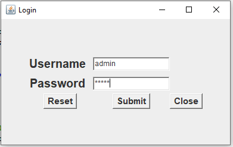
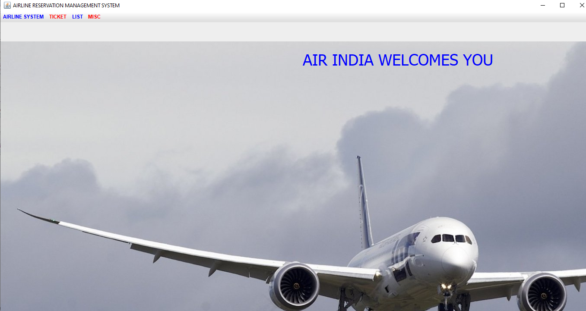
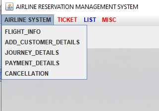
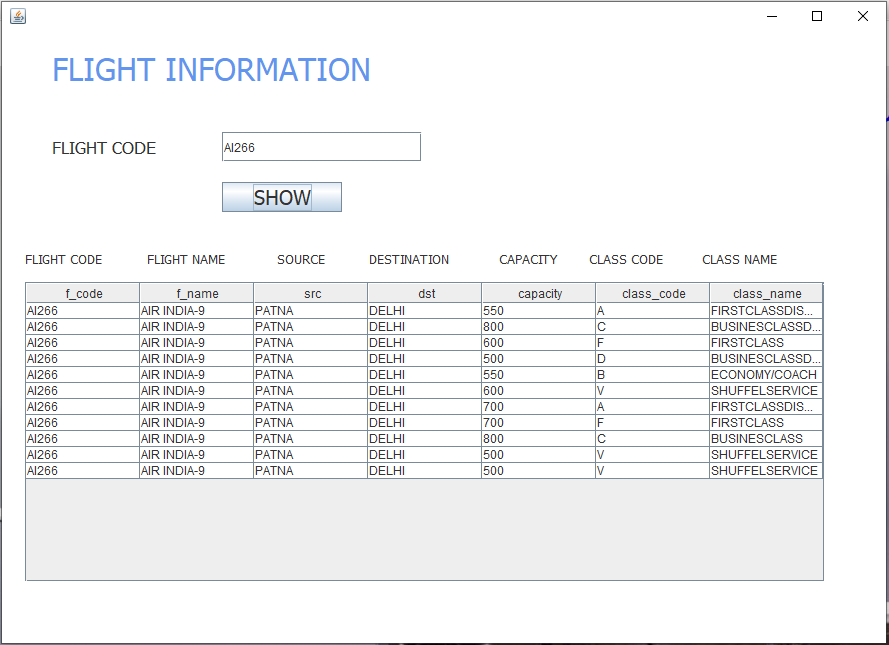
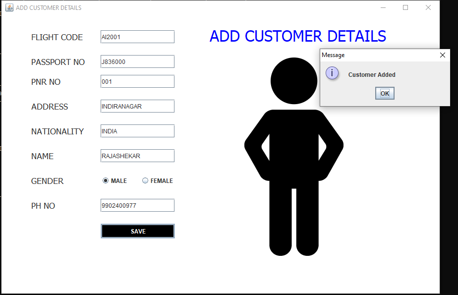
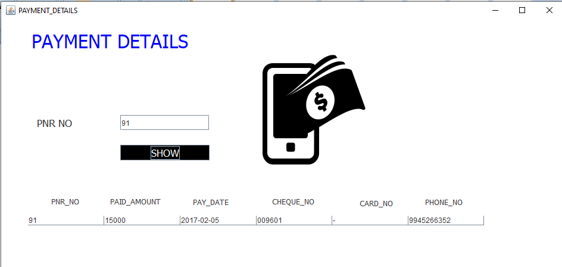
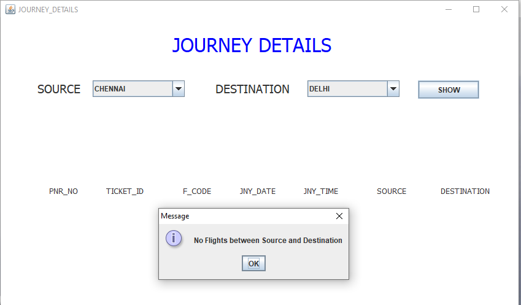
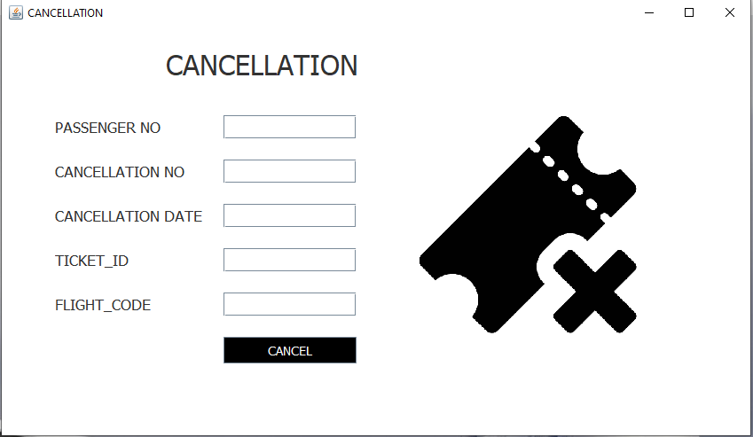
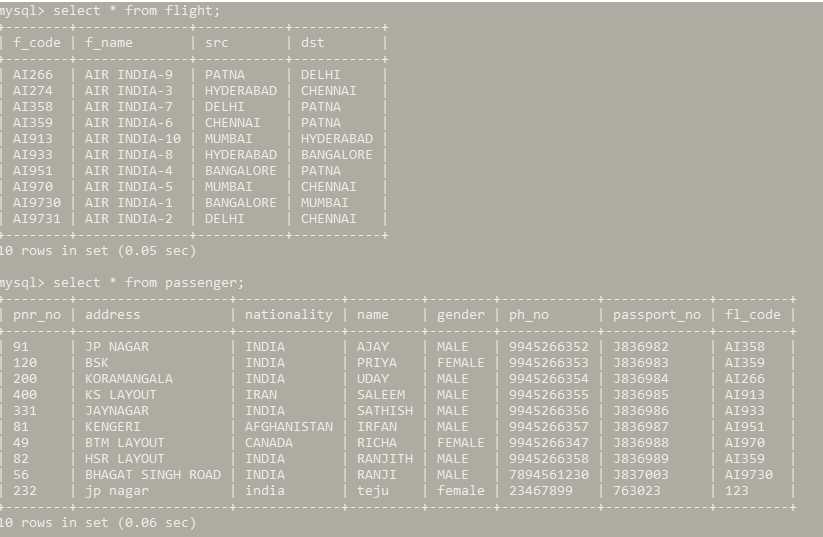

# Airline Management System

A comprehensive Java-based airline management system built using Swing for the graphical user interface. This application provides a complete solution for managing airline operations, customer bookings, and flight information.

## Features

- **User-friendly Interface**: Clean and intuitive GUI built with Java Swing
- **Customer Management**: Add and manage customer details
- **Flight Management**:
    - View flight information
    - Book flights
    - Generate boarding passes
- **Journey Tracking**: Access detailed journey information
- **Air India Branded**: Custom themed interface with airline branding

## Technical Details

- **Development Environment**: IntelliJ IDEA
- **Programming Language**: Java
- **GUI Framework**: Java Swing
- **Architecture**: Event-driven architecture with ActionListener implementation

## System Requirements

- Java Runtime Environment (JRE) 8 or higher
- Minimum screen resolution: 1600x800
- Operating System: Windows/Mac/Linux

## Installation

1. Clone the repository
2. Open the project in IntelliJ IDEA
3. Build the project
4. Run the `Home.java` file

## Usage

1. Launch the application
2. Use the menu bar to navigate between different features:
    - **Details Menu**:
        - Add Customer Details
        - View Flight Information
        - Book Flights
        - Access Journey Details
    - **Ticket Menu**:
        - Generate Boarding Pass

## Project Structure

```
airlinemanagementsystem/
├── Home.java              # Main application window
├── AddCustomer.java       # Customer registration
├── BookFlight.java        # Flight booking
├── FlightInfo.java        # Flight information
├── JourneyDetails.java    # Journey tracking
├── BoardingPass.java      # Boarding pass generation
└── icons/
    └── front.jpg         # Application background image
```

## Contributing

Feel free to fork this repository and submit pull requests for any improvements.

## License

MIT license

## Output: 
### Login Operation


### Mainframe


### DropDown Menu


### Flight Information


### Adding Customer


### Payment Details


### Journey Details


### Cancellation


### Backend Records:

